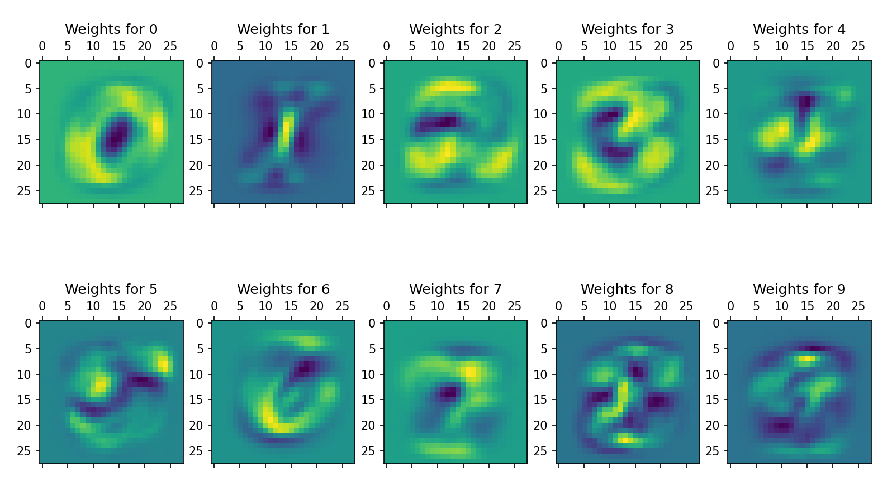

# MNIST Digit Classification with Linear Model


A minimal PyTorch implementation for handwritten digit recognition using a linear layer. Demonstrates core machine learning workflows - training, visualization of learned patterns, and real-world inference.

---

## Features
- 🎯 **Linear Model**: 784x10 weight matrix for MNIST classification
- 🔥 **Fast Training**: <1 minute on CPU (25 epochs)
- 🎨 **Weight Heatmaps**: Visualize proto-digit patterns via `weight_viz.py`
- ✏️ **Drawing Inference**: Predict hand-drawn 28x28 images

## Quick Start
```bash
pip install torch torchvision matplotlib pillow
python bce.py              # Train (saves bce.pth)
python weight_viz.py       # Show weight heatmaps
python inference.py        # Predict drawing.png
```

## Key Components
- **Weights as Templates**:
`weight_viz.py` plots 28x28 weight slices for each digit. Patterns resemble fuzzy digits, visualizing the model's learned encoding of each clSs
- **Minimal Inference**
`inference.py` processes images by:
1. Grayscale and resizing to 28x28
2. Flatten to 784D vector
3. Outputs predicted digit + raw logits

## Next Steps
* Test **harmonic loss** to see if paper findings replicate
* Build interactive drawing display
* Visualize more advanced models (i.e convolutional)